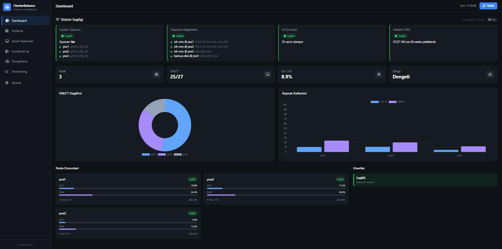
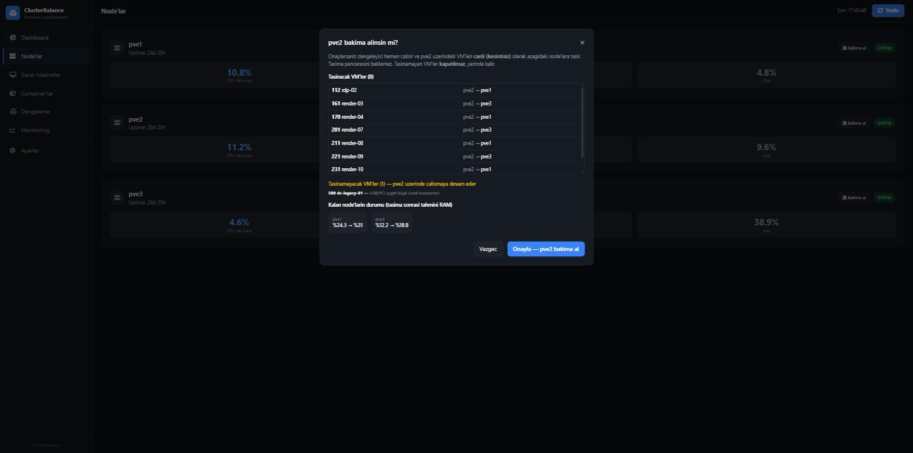
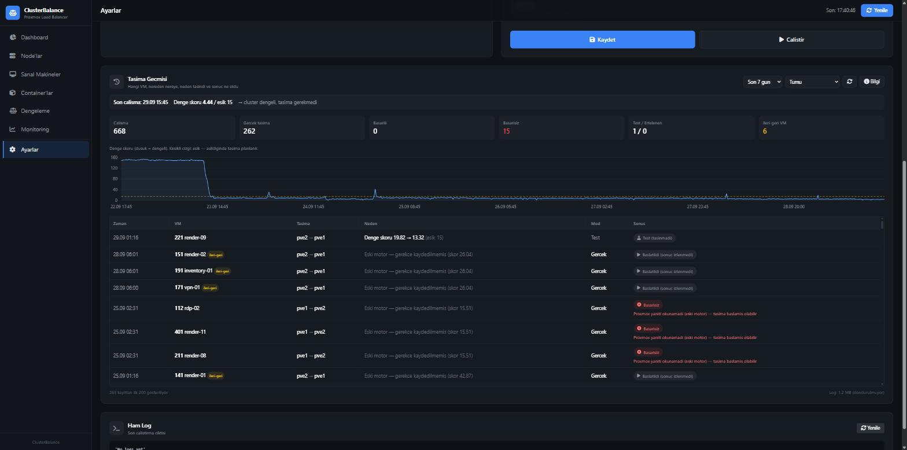

# ClusterBalance v2

**Proxmox VE cluster'ları için güvenliği ön planda tutan yük dengeleyici, bakım modu ve sağlık paneli.**

[](LICENSE)


🇬🇧 [English README](README.md)



ClusterBalance, Proxmox VE cluster'ınızın bir node'unda çalışır. 15 dakikada bir node'ların ne kadar
dengeli yüklendiğini ölçer; fark fazlaysa **birkaç VM'i canlı (kesintisiz) taşıyarak** dengeler — ama sadece
taşıma güvenliyse ve gerçekten işe yarıyorsa. Bunun yanında:

- bir node'u güncelleme/yeniden başlatma öncesi boşaltan ve sonra her VM'i geri taşıyan **bakım modu**,
- cluster sağlığı, taşıma geçmişi ve ayarları içeren bir **web paneli**,
- **Proxmox arayüzünün içinde** küçük bir durum kutusu,
- e-posta/Teams/Slack uyarıları için sorgulanabilen bir **sağlık API'si** (hazır n8n akışı dahil).

### v2'de neler yeni?

Sürüm 2, Cemal Demirci'nin yazdığı özgün ClusterBalance'ın canlı ortamda sınanmış, sağlamlaştırılmış halidir:
depolama ve HA'yı dikkate alan güvenlik kontrolleri, ileri-geri taşımaları bitiren simülasyonlu planlama, taşıma penceresi,
sonucu beklenen taşımalar, otomatik geri dönüşlü bakım modu, sağlık kartları ve taşıma geçmişi olan şifreli HTTPS panel
ve hazır uyarılar. Ayrıntılar: [CHANGELOG](CHANGELOG.md).

---

## İçindekiler

- [Bu proje neden var?](#bu-proje-neden-var)
- [Özellikler](#özellikler)
- [Dengeleme nasıl çalışır?](#dengeleme-nasıl-çalışır)
- [Gereksinimler](#gereksinimler)
- [Kurulum](#kurulum)
- [Ayarlar](#ayarlar)
- [Panel](#panel)
- [Bakım modu](#bakım-modu)
- [Taşıma geçmişi](#taşıma-geçmişi)
- [Sağlık API'si ve uyarılar](#sağlık-apisi-ve-uyarılar)
- [API listesi](#api-listesi)
- [Güvenlik](#güvenlik)
- [Sorun giderme](#sorun-giderme)
- [Güncelleme ve kaldırma](#güncelleme-ve-kaldırma)
- [Kısıtlar ve yol haritası](#kısıtlar-ve-yol-haritası)
- [Emeği geçenler](#emeği-geçenler) · [Lisans](#lisans)

---

## Bu proje neden var?

ClusterBalance, VM diskleri paylaşımlı bir NFS depolamada duran 3 node'luk bir Proxmox VE cluster'ı için
şirket içi bir araç olarak başladı. Aylarca canlı ortamda çalıştırırken, otomatik bir dengeleyicinin
**asla yapmaması gerekenleri** — bazen acı tecrübeyle — öğrendik. Bu depodaki her güvenlik önlemi gerçek bir olaydan geliyor:

| Ne oldu | ClusterBalance artık ne yapıyor |
|---|---|
| Cluster'ın toplu yeniden başlatılmasından sonra iki node paylaşımlı NFS diskini sessizce bağlayamadı. Proxmox depolamayı "aktif" göstermeye devam etti; **3 hafta boyunca HA hiçbir VM'i başka node'a geçiremezdi** ve dengeleyici VM'leri disklerini göremeyen node'lara taşımaya çalıştı. | Her taşımadan önce **VM'in her diskinin, hedef node'da etkin, paylaşımlı ve gerçekten bağlı bir depolamada olduğunu** kontrol eder. Panelde disk bağlantı kartı var; uyarı akışı 5 dakika içinde e-posta atar. |
| İlk sürüm "en büyük" 3 VM'i seçip hepsini yeniden hesaplamadan aynı node'a gönderiyordu. Birkaç ayda **~7.000 taşıma denemesi** yaptı, aynı VM'ler node'lar arasında gidip geldi. | Planlama **simülasyonlu**: her taşımadan sonra yükler yeniden hesaplanır, dengesizliği en az `min_improvement` kadar azaltmayan taşıma yapılmaz; geçmiş ekranı **ileri-geri** taşınan VM'leri işaretler. |
| Taşımalar 5 saniye arayla, birbirini beklemeden başlatılıyor ve "başladı" demek "başarılı" sayılıyordu. | Her taşıma **beklenir**: önce Proxmox görevi, sonra VM'in hedefte gerçekten *çalıştığı* görülene kadar (HA'lı VM'lerde de). Hata ve zaman aşımı nedeniyle birlikte kaydedilir. |
| VM'ler mesai ortasında taşınıyordu. | Dengeleme taşımaları sadece **taşıma penceresinde** (varsayılan `20:00–07:00`) yapılır. Tek istisna bakım modu. |
| USB lisans anahtarı takılı bir VM, EFI diski node'un yerel diskinde olan bir VM ve kısıtlı HA grubundaki bir VM taşınmaya aday olabiliyordu. | **USB/PCI aktarımı, yerel disk ve kısıtlı HA grubu** algılanır, bu VM'ler asla taşınmaz. |
| İlk panelde giriş yoktu; herhangi bir tarayıcı sekmesinden tüm node'larda root komutu çalıştırılabiliyordu. | Panel **HTTPS üzerinden girişli**, tehlikeli uç noktalar kaldırıldı, CORS kapalı. |

Bu dersler her Proxmox cluster'ı için geçerli olduğu için yayınlıyoruz.

## Özellikler

**Dengeleyici** (`balancer/balancer.py`, 15 dakikada bir systemd zamanlayıcısı)
- Node skoru: kullanılan RAM, CPU, kök disk ve isteğe bağlı I/O (ağırlıklar ayarlanabilir); ya da atanmış kaynaklar ya da PSI.
- Simülasyonlu planlama, `min_improvement`, çalışma başına `max_migrations`, taşıma penceresi.
- VM ve hedef node başına güvenlik kontrolleri: paylaşımlı + etkin + bağlı depolama, HA grup kısıtları, USB/PCI, aşırı yüklenme koruması.
- Etiket kuralları: hariç tut (`kritik`, `critical`, `pinned`, `no-migrate`, `cb_ignore*`), node'a sabitle (`cb_pin_<node>`), birlikte tut (`cb_affinity_<grup>`), ayrı tut (`cb_anti_affinity_<grup>`).
- Sadece kararları yazan `dry_run` (test) modu — kurulumdan sonra varsayılan.

**Bakım modu**
- Panelde tek tık: önizleme → node'u boşalt → *"node boş, güvenle yeniden başlatılabilir"* → bakımdan çık → her VM eski yerine döner.
- Normal dengelemede hariç tutulan VM'leri de taşıyabilir; taşınamayanlar nedeniyle listelenir ve **asla kapatılmaz**.

**Panel** (`dashboard/app.py`, HTTPS, girişli)
- Sağlık kartları: quorum/node'lar, node başına paylaşımlı disk bağlantısı, HA servisleri, VM başına son PBS yedeği, başarısız görevler.
- Neden, sonuç, süre ve hata mesajlarıyla taşıma geçmişi; denge skoru grafiği ve ileri-geri tespiti.
- Ayarlar (eşik, mod, taşıma sayısı, hariç etiketler, dry run), elle test çalıştırma, ham log.
- Önizlemeli bakım modu ekranı.

**Proxmox arayüz kutusu** — Proxmox web arayüzünde denge durumunu gösteren ve panele bağlantı veren küçük kutu.

**Uyarılar** — `GET /api/health` tüm cluster'ın durumunu tek JSON'da döner; hazır n8n akışı sadece bir durum değiştiğinde (sorun / uyarı / düzeldi) anlaşılır bir HTML e-posta gönderir.

| Bakım önizlemesi | Taşıma geçmişi |
|---|---|
|  |  |

## Dengeleme nasıl çalışır?

Her çalışmada (varsayılan 15 dakikada bir):

1. **Veri toplama:** `pvesh get /cluster/resources` ile node ve VM'ler, depolama tanımları, HA grupları/kaynakları ve her VM'in ayarları.
2. **Skorlama:** varsayılan `method: combined`, `mode: used` ile:

   ```
   node_skoru = RAM% × memory_weight + CPU% × cpu_weight + kökdisk% × disk_weight (+ io_wait × io_weight)
   denge_skoru (balanciness) = max(node_skoru) − min(node_skoru)
   ```
3. `denge_skoru <= balanciness_threshold` ise yapılacak bir şey yok.
4. Değilse **simülasyonlu planlama**: her aday VM için izin verilen en iyi hedef seçilir, taşıma sanal olarak yapılır ve
   dengesizliği en çok azaltan taşıma — en az `min_improvement` kadar azaltıyorsa — alınır. Sanal duruma uygulanır ve
   denge sağlanana ya da `max_migrations` dolana kadar tekrarlanır.
5. **Uygulama** (sadece `migration_window` içinde, `dry_run` kapalıysa): `pvesh create /nodes/<kaynak>/qemu/<id>/migrate --target <hedef> --online 1`,
   ardından görev ve VM'in hedefte *çalışır* olması beklenir (`migration_timeout`'a kadar).

Bir VM şu durumlarda **asla** aday olmaz: kapalıysa; etiket/ID/ad ile hariçse; USB/PCI aktarımı varsa; başka node'a sabitlenmişse;
herhangi bir diski/ISO'su yerel, devre dışı, hedefte tanımsız ya da hedefte **bağlı olmayan** bir depolamadaysa.
Kısıtlı HA grubu dışındaki, bakımdaki ya da `max_memory_usage`'ı aşacak hedefler atlanır.
Nedenler log'a yazılır ve panelde gösterilir ("VM X neden Y node'una gidemiyor").

## Gereksinimler

- Proxmox VE 8.x cluster (8.4 üzerinde geliştirildi ve kullanılıyor), 2+ node.
- Canlı taşıma için paylaşımlı depolama (NFS, Ceph, iSCSI/LVM, …). Node'a yerel diskler hiç taşınmaz.
- ClusterBalance'ın çalışacağı node'da: `python3`, `python3-flask`, `python3-yaml` (`install.sh` Debian depolarından kurar)
  ve node'lar arası root SSH (Proxmox cluster'ında standart — disk bağlantı kontrolü ve arayüz kutusu için).

## Kurulum

Cluster'ın **bir** node'unda, root olarak:

```bash
git clone https://github.com/muammer-yesilyagci/clusterbalance.git
cd clusterbalance
./install.sh            # dengeleyici + panel
./install.sh --widget   # isteğe bağlı: tüm node'larda Proxmox arayüzüne kutuyu da ekler
```

Kurulum betiği:
- dengeleyiciyi ve paneli `/opt/clusterbalance/` altına kopyalar,
- örnekten **`dry_run: true`** ile `/opt/clusterbalance/config.yaml` oluşturur (varsa mevcut ayar korunur),
- panel kullanıcı adı/şifresi sorar (`/etc/clusterbalance/dashboard-users` içinde werkzeug hash olarak saklanır),
- `clusterbalance.service` + `clusterbalance.timer`, `clusterbalance-dashboard.service` ve logrotate kurar.

Sonra:

1. `https://<node-ip>:5000` adresini açın (node'un Proxmox sertifikası kullanılır; tarayıcı `:8006`'daki uyarının aynısını gösterir).
2. Bir iki gün **Ayarlar → Taşıma Geçmişi**'ni izleyin: her karar görünür, test modunda hiçbir şey taşınmaz.
3. Kararlar mantıklıysa paneldeki **Dry Run** anahtarını kapatın.

İstediğiniz an elle deneyebilirsiniz — test modunda asla taşıma yapmaz:

```bash
python3 /opt/clusterbalance/balancer.py --dry-run
```

## Ayarlar

`/opt/clusterbalance/config.yaml` — tüm seçenekler için [`balancer/config.example.yaml`](balancer/config.example.yaml).
En önemlileri:

| Anahtar | Varsayılan | Anlamı |
|---|---|---|
| `enabled` | `true` | Ana anahtar |
| `dry_run` | `true` | Sadece "şunu taşırdım" diye log yazar |
| `method` | `combined` | `memory`, `cpu`, `disk`, `io` ya da `combined` |
| `mode` | `used` | `used` (gerçek kullanım), `assigned` (atanmış RAM/çekirdek), `psi` |
| `memory_weight` / `cpu_weight` / `disk_weight` / `io_weight` | 2 / 1 / 1 / 1,5 | Node skorundaki ağırlıklar |
| `balanciness_threshold` | `15` | Node'lar arası izin verilen skor farkı |
| `min_improvement` | `5.0` | Bir taşıma farkı en az bu kadar azaltmalı |
| `max_migrations` | `3` | Çalışma başına dengeleme taşıması |
| `migration_window` | `20:00-07:00` | Gerçek dengeleme taşımaları sadece bu aralıkta (`""` = her zaman) |
| `migration_type` | `live` | `live` (canlı) ya da `offline` |
| `migration_timeout` | `900` | Bir taşıma için beklenecek saniye |
| `exclude_tags` | `kritik, critical, pinned, no-migrate` | Dengelemeden hariç Proxmox etiketleri |
| `exclude_vmids` / `exclude_names` | `[]` | Ek hariç tutmalar |
| `maintenance_nodes` | `[]` | Boşaltılan node'lar (panelden ayarlanır) |
| `maintenance_include_excluded` | `true` | Bakımda hariç tutulan VM'leri de taşı |
| `overprovisioning_protection` / `max_memory_usage` | `true` / `95` | Hiçbir node'u bu RAM %'sinin üstüne çıkarma |
| `with_local_disks` | `false` | Yerel diskli VM'leri taşımaya izin ver (önerilmez) |

Etiket önekleri (Proxmox VM etiketleri): `cb_ignore…` (hariç), `cb_pin_<node>` (node'da tut),
`cb_affinity_<grup>` (birlikte tut), `cb_anti_affinity_<grup>` (ayrı tut).

Panel ortam değişkenleri (`clusterbalance-dashboard.service` içinde):

| Değişken | Varsayılan |
|---|---|
| `CB_DASHBOARD_PORT` | `5000` |
| `CB_USERS_FILE` | `/etc/clusterbalance/dashboard-users` |
| `CB_TLS_CERT` / `CB_TLS_KEY` | `/etc/pve/local/pve-ssl.pem` / `.key` |
| `CB_BACKUP_STORAGE` | ilk etkin PBS depolaması |
| `CB_DIR`, `CB_CONFIG`, `CB_LOG`, `CB_STATE_FILE` | `/opt/clusterbalance`, `…/config.yaml`, `/var/log/clusterbalance.log`, `…/maintenance_state.json` |

Panele kullanıcı eklemek:

```bash
python3 -c "import getpass;from werkzeug.security import generate_password_hash as g;print('ayse:'+g(getpass.getpass()))" >> /etc/clusterbalance/dashboard-users
```

## Panel

| Sayfa | İçerik |
|---|---|
| **Dashboard** | Sağlık kartları (renklerin anlamını anlatan ⓘ Bilgi kutusuyla), cluster toplamları, VM dağılımı ve kaynak grafikleri |
| **Node'lar** | Node başına CPU/RAM/disk ve **bakım modu** butonları |
| **Sanal Makineler / Container'lar** | Durum, CPU, bellek |
| **Monitoring** | Cluster CPU/RAM/disk göstergeleri |
| **Ayarlar** | Dengeleyici ayarları, elle test, **taşıma geçmişi**, ham log |

Renk sadece anlam taşıyorsa kullanılır: yeşil/sarı/kırmızı = durum, mavi = işlem, her veri serisine tek renk.

## Bakım modu

**Node'lar → Bakıma al**

1. **Önizleme** (~40 sn, sadece okuma): hangi VM hangi node'a gidecek, hangileri taşınamaz ve neden
   (ör. *"USB/PCI aygıtı bağlı"*), kalan node'ların tahmini RAM kullanımı.
2. **Onay**: node `maintenance_nodes`'a eklenir ve dengeleyici hemen çalışır. Bakım taşımaları taşıma penceresini beklemez.
   Bir şerit ilerlemeyi gösterir; node boşalınca güvenle yeniden başlatılabileceğini söyler.
3. **Bakımdan çıkar**: boşaltılan her VM **eski node'una canlı olarak geri taşınır**
   (`/opt/clusterbalance/maintenance_state.json`'da tutulur, 5 çalışmaya kadar tekrar denenir).

Kurallar: aynı anda tek node; taşınamayan VM'ler node'da çalışmaya devam eder ve **asla kapatılmaz**;
her giriş/çıkış journal'a `AUDIT … <kullanıcı>: …` olarak yazılır.

Komut satırından önizleme (log'a yazmaz):

```bash
python3 /opt/clusterbalance/balancer.py --maintenance-preview pve2
```

## Taşıma geçmişi

Ayarlar → **Taşıma Geçmişi**, `/var/log/clusterbalance.log` (ve döndürülmüş kopyaları) okunarak oluşturulur. Her taşıma için:
zaman, VM, kaynak → hedef, **neden** (öncesi → sonrası denge skoru, bakım, bakım sonrası dönüş), mod (gerçek/test) ve **sonuç**:

| Sonuç | Anlamı |
|---|---|
| Başarılı + süre | VM hedefte çalışıyor |
| Başarısız / Zaman aşımı | Hata mesajıyla (ör. *"VM o sırada yedekleniyordu"*) |
| Ertelendi | Taşıma penceresi dışında planlandı |
| Test | Dry run: planlandı, taşınmadı |

Ayrıca: son çalışmanın kararı düz cümleyle, özet sayılar, eşik çizgili denge skoru grafiği,
filtreler (gerçek / test / başarısız / ileri-geri) ve 24 saatte geri taşınan ya da 3+ kez taşınan VM'ler için **ileri-geri** etiketi.

## Sağlık API'si ve uyarılar

`GET /api/health` (giriş gerekli) tüm cluster'ın durumunu tek çağrıda döner:

```json
{
  "cluster":  { "ok": true, "quorate": true, "nodes": [{ "name": "pve1", "online": true, "uptime": 2462400 }] },
  "storage":  { "ok": false, "items": [{ "storage": "nfs-vms", "node": "pve2", "mounted": false, "path": "/mnt/nfs-vms" }] },
  "ha":       { "ok": true, "total": 25, "bad": [] },
  "backups":  { "ok": true, "storage": "pbs", "total": 27, "newest_ok": 27, "problems": [] },
  "tasks":    { "ok": true, "count": 0, "failed": [] },
  "time": "17:40:46"
}
```

Kurallar: quorum yoksa ya da bir node çevrimdışıysa; paylaşımlı *dir* depolama bir node'da bağlı değilse;
bir HA servisi `error/fence/recovery/freeze` durumundaysa ya da çalışması istenip çalışmıyorsa; bir VM'in son PBS yedeği
50 saatten eskiyse (26 saatten sonra uyarı) ya da hiç yoksa kart kırmızıya döner; son 24 saatin başarısız görevleri listelenir.

**n8n akışı** — [`alerts/n8n-health-alert.json`](alerts/n8n-health-alert.json):
5 dakikada bir `/api/health`'i sorgular ve **sadece durum değiştiğinde** HTML e-posta gönderir
(`[SORUN]` / `[UYARI]` / `[DÜZELDİ]`); ne değiştiğini, ne yapılması gerektiğini ve bir durum tablosunu içerir.

1. n8n → panel kullanıcısıyla bir *Basic Auth* credential oluşturun (ayrı bir kullanıcı önerilir, ör. `n8n`).
2. Akışı içeri aktarın; URL'yi (`https://NODE-ADRESI:5000/api/health`) girin, *Ignore SSL Issues*'ı açın, SMTP credential'ınızı ve e-posta adreslerini seçin (Code kutusunun başındaki panel adresini de).
3. Akışı aktif edin / yayınlayın.

Başka sorgulayıcılar da olur (Uptime Kuma anahtar kelime izleme, cron + curl, Zabbix HTTP agent …).

## API listesi

`/api/widget-summary` dışında tüm uç noktalar HTTP Basic giriş ister.

| Uç nokta | Açıklama |
|---|---|
| `GET /api/health` | Cluster sağlığı (yukarıda) |
| `GET /api/history?hours=168` | Taşıma geçmişi, çalışmalar, grafik verisi |
| `GET /api/maintenance` | Node başına bakım durumu |
| `GET /api/maintenance/preview?node=X` | Boşaltma önizlemesi (sadece okuma) |
| `POST /api/maintenance/enter` `{"node":"X"}` | Node'u bakıma al |
| `POST /api/maintenance/exit` `{"node":"X"}` | Bakımdan çıkar, VM'leri geri taşı |
| `GET/POST /api/config` | Dengeleyici ayarlarını oku / değiştir |
| `POST /api/proxmox/run-balance` | Dengeleyiciyi şimdi test modunda çalıştır |
| `GET /api/proxmox/balance-status` | Son 50 log satırı |
| `GET /api/summary`, `/api/nodes`, `/api/guests`, `/api/distribution`, `/api/top`, `/api/recommendations` | Panel sayfalarının verisi |
| `GET /api/widget-summary` | **Girişsiz**, Proxmox arayüz kutusu için en temel sayılar; CORS sadece `https://<cluster node>:8006` için açık |

## Güvenlik

- Dengeleyici ve panel **root** olarak çalışır (`pvesh` ve diğer node'lara SSH kullanır). Paneli Proxmox arayüzü gibi düşünün: yönetim ağında tutun, internete asla açmayın.
- Panel sadece HTTPS ile çalışır; widget özeti dışındaki her uç nokta giriş ister. Başka kaynaklara CORS yok.
- Şifreler werkzeug hash olarak saklanır. Otomasyon (n8n) için ayrı kullanıcı kullanın.
- Panel dengeleyici ayarlarını değiştirebilir ve node'ları bakıma alabilir — yani canlı taşımaya yol açabilir. Keyfi komut çalıştıramaz.
- Yerleşik Flask/werkzeug sunucusu birkaç yönetici için yeterlidir; daha fazlası için bir reverse proxy arkasına koyun.

## Sorun giderme

| Belirti | Kontrol |
|---|---|
| Hiç taşıma yapılmıyor | `dry_run` hâlâ açık mı? `migration_window` içinde misiniz? Taşıma Geçmişi'ndeki "Son çalışma" nedenini yazar (dengeli / yeterince iyileştiren taşıma yok / VM'ler nedenleriyle reddedildi). |
| "Disk bağlı değil" kartı kırmızı | O node'da: `findmnt <yol>`; bağlayın ve `/etc/fstab`'ı düzeltin (`_netdev,x-systemd.automount`). `dir` depolamalar için Proxmox'ta `is_mountpoint` de ayarlayın. |
| Panel açılmıyor | `journalctl -u clusterbalance-dashboard -e` — genelde kullanıcı dosyası ya da sertifika yolu eksiktir. |
| Kutu "Bağlantı Hatası" gösteriyor | O tarayıcıda panel adresini bir kez açıp sertifikayı kabul edin. |
| Güncellemeden sonra kutu kayboldu | `pve-manager` güncellemesi `index.html.tpl`'yi değiştirir; `./install.sh --widget`'ı tekrar çalıştırın. |
| Taşıma geçmişi boş | `/var/log/clusterbalance.log` yazılıyor mu? `systemctl list-timers clusterbalance.timer` |

## Güncelleme ve kaldırma

Güncelleme: `git pull && ./install.sh` (ayar ve kullanıcılar korunur).

Kaldırma:

```bash
systemctl disable --now clusterbalance.timer clusterbalance-dashboard.service
rm -f /etc/systemd/system/clusterbalance*.{service,timer} /etc/logrotate.d/clusterbalance
rm -rf /opt/clusterbalance /etc/clusterbalance
# arayüz kutusu, her node'da:
sed -i '/clusterbalance.js/d' /usr/share/pve-manager/index.html.tpl; rm -f /usr/share/pve-manager/js/clusterbalance.js
```

## Kısıtlar ve yol haritası

- Panel arayüzü şimdilik sadece Türkçe (çeviri katkılarına açığız).
- Kurulum başına tek cluster; dengeleyici tek node'da çalışır (o node kapalıysa dengeleme durur — HA çalışmaya devam eder).
- Planlananlar: İngilizce arayüz, node başına geçmiş grafikleri, root olmayan API anahtarı, N-1 kapasite kartı, VM başına "taşınabilirlik" görünümü, affinity etiketleri için kural editörü.

## Katkı

Issue ve pull request'lere açığız. Dengeleme davranışı bildirirken cluster'ınızı (Proxmox sürümü, node sayısı, depolama türü)
yazın ve `/var/log/clusterbalance.log`'un ilgili kısmını ekleyin.

## Emeği geçenler

- **Muammer Yeşilyağcı** ([@muammer-yesilyagci](https://github.com/muammer-yesilyagci)) — proje sahibi; ClusterBalance v2: güvenlik kontrolleri, bakım modu, sağlık kartları, taşıma geçmişi, uyarılar ve dokümantasyon.
- **Cemal Demirci** ([@cemal-demirci](https://github.com/cemal-demirci)) — ClusterBalance v1'in, panelin ve Proxmox arayüz kutusunun özgün yazarı; v2'nin geliştirilmesinde birlikte çalıştı.

## Lisans

[MIT](LICENSE)
